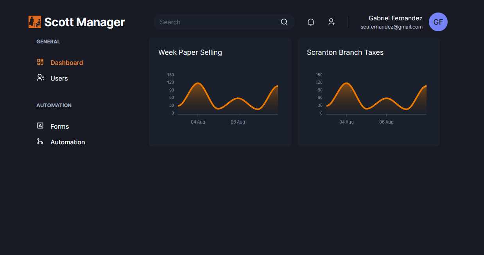
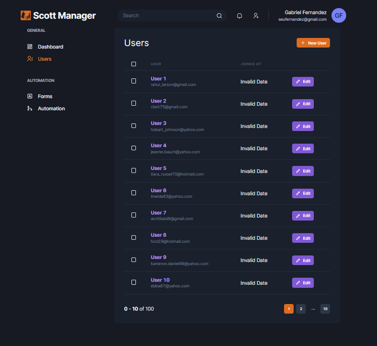

<h1 align="center">
  Scott Manager
</h1>
<h1 align="center">
    
    
</h1>

<br>

## 🧪 Technologies

This project was made using the followings Technologies:

 - [React](https://pt-br.reactjs.org/)
 - [Typescript](https://pt-br.reactjs.org/)
 - [NextJS](https://nextjs.org/)
 - [Chakra UI](https://chakra-ui.com/)
 - [Emotion](https://emotion.sh/docs/styled)
 - [Apexcharts](https://apexcharts.com/)
 - [Framer Motion](https://www.framer.com/motion/)
 - [Yup](https://github.com/jquense/yupp)
 - [React Hook Form](https://react-hook-form.com/)
 - [React Icons](https://react-icons.github.io/react-icons/)

## 🪐 Running

Para iniciá-lo, siga os passos abaixo:

```bash
# Install all dependencies
$ yarn

# Starting App
$ yarn start
```

App will be available on port: http://localhost:3000.

## 💻 Project

Scott Manager is a Filial Branch Manager, made especially for your Paper company! 

---

Made with 🧡 by Gabriel Fernandes 👋 [Join our community!](https://ahub.tech/discord)
